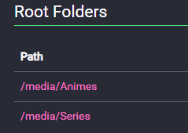
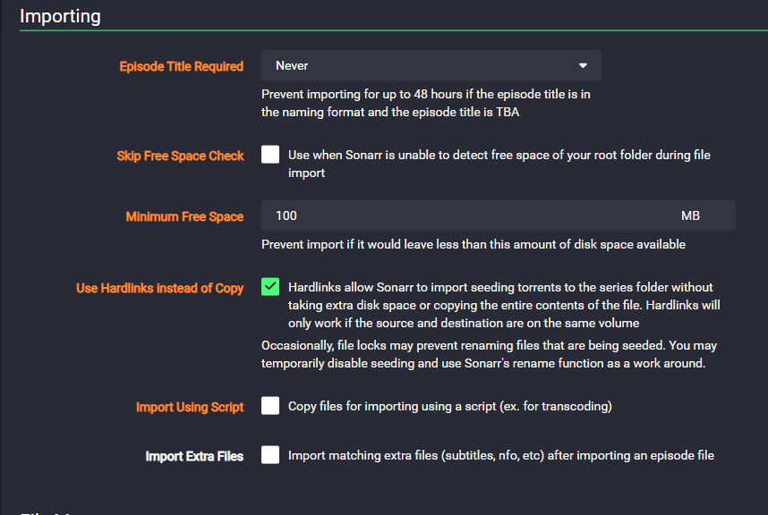

This repository is a tutorial on configuring sonarr/prowlarr/qbit and plex

I try to use the minimun ammount of volumes possible
All containers below are used with docker-compose in portainer


This is my Sonarr:
```
services:
  sonarr:
    image: linuxserver/sonarr:develop
    container_name: sonarr
    environment:
      - PUID=1000
      - PGID=1000
      - TZ=America/Sao_Paulo
      - DOCKER_MODS=ghcr.io/gilbn/theme.park:sonarr
      - TP_THEME=dracula
    labels:
      - "com.centurylinklabs.watchtower.monitor-only=true" #This label is to prevent watchtowerr to update the container when it is importing files
    volumes:
      - /docker/sonarr:/config
      - /media:/media   #This volume is shared between Sonarr and Plex
      - /media/downloads:/downloads #This volume is shared between all other containers
    ports:
      - 8989:8989
    restart: unless-stopped
    network_mode: bridge
```

This is my Prowlarr:
```
services:
  prowlarr:
    image: linuxserver/prowlarr:latest
    container_name: prowlarr
    environment:
      - PUID=1000
      - PGID=1000
      - TZ=America/Sao_Paulo
      - DOCKER_MODS=ghcr.io/gilbn/theme.park:prowlarr
      - TP_THEME=dracula
    volumes:
      - /docker/prowlarr:/config
    ports:
      - 9696:9696
    restart: unless-stopped
    network_mode: bridge

  flaresolverr:
    image: ghcr.io/flaresolverr/flaresolverr:latest
    container_name: flaresolverr
    environment:
      - LOG_LEVEL=info
      - TZ=America/Sao_Paulo
    ports:
      - 8191:8191
    restart: unless-stopped
    network_mode: bridge
```

This is my qBit:
```
services:
  qbittorrent:
    image: linuxserver/qbittorrent:latest
    container_name: qbittorrent
    environment:
      - PUID=1000
      - PGID=1000
      - TZ=America/Sao_Paulo
      - WEBUI_PORT=2081
    ports:
      - 2081:2081
      - 6059:6059/udp
    labels:
      - "com.centurylinklabs.watchtower.monitor-only=true" #This label is to prevent watchtowerr to update the container when it is downloading files
    volumes:
      - /docker/qbittorrent:/config
      - /media/downloads:/downloads #This volume is shared between all other containers
    restart: unless-stopped
    network_mode: bridge
```
This is my Plex:
```
services:
  plex:
    image: linuxserver/plex:latest
    container_name: plex
    network_mode: host
    environment:
      - PUID=1000
      - PGID=1000
      - TZ=America/Sao_Paulo
      - VERSION=docker
    labels:
      - "com.centurylinklabs.watchtower.monitor-only=true" #This label is to prevent watchtowerr to update the container when it is streaming
    volumes:
      - /docker/plex:/config
      - /media/Series:/media/Series
      - /media/Animes:/media/Animes
      - /media/Movies:/media/Movies
      - /media/downloads/xteve:/media/xteve
    restart: unless-stopped
```

As the download folder is shared between qbit and sonarr, sonarr can import the files directly to the media folder without needing to configure anything else

Root folders on Sonarr can be set as the following:<br>


For downloading episodes with naming as TBA, you must set the following configurations:<br>
